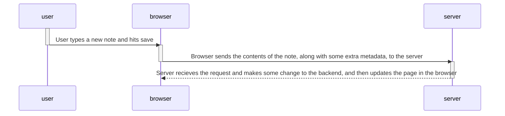

```mermaid
sequenceDiagram

participant user
participant browser
participant server

activate user
user->>browser:User types a new note and hits save
deactivate user

activate browser
browser->>server:Browser sends the contents of the note, along with some extra metadata, to the server 
deactivate browser

activate server
server-->>browser:Server recieves the request and makes some change to the backend, and then updates the page in the browser
deactivate server
```