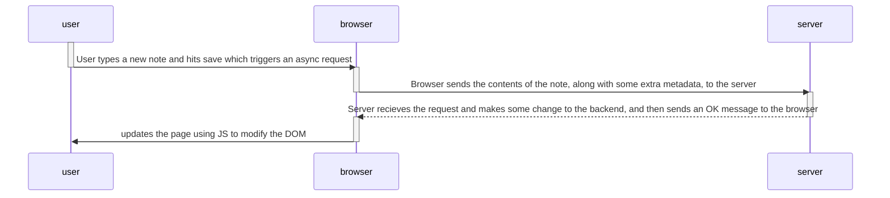

```mermaid
sequenceDiagram

participant user
participant browser
participant server

activate user
user->>browser:User types a new note and hits save which triggers an async request
deactivate user

activate browser
browser->>server:Browser sends the contents of the note, along with some extra metadata, to the server 
deactivate browser

activate server
server-->>browser:Server recieves the request and makes some change to the backend, and then sends an OK message to the browser
deactivate server

activate browser
browser->>user:updates the page using JS to modify the DOM
deactivate browser
```