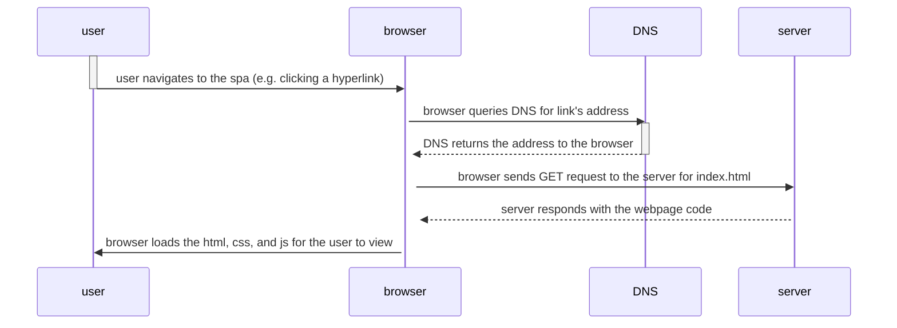

```mermaid
sequenceDiagram

participant user
participant browser
participant DNS
participant server

activate user
user->>browser:user navigates to the spa (e.g. clicking a hyperlink)
deactivate user

activate browser
browser->>DNS:browser queries DNS for link's address
activate browser

activate DNS
DNS-->>browser:DNS returns the address to the browser
deactivate DNS

activate browser
browser->>server:browser sends GET request to the server for index.html
activate browser

activate server
server-->>browser:server responds with the webpage code
activate server

activate browser
browser->>user:browser loads the html, css, and js for the user to view
activate browser
```